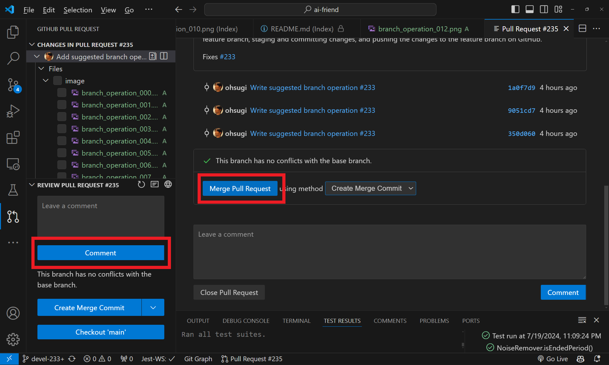

# Edge-Ghost

Edge-Ghost is a web-based AI Orchestrator that orchestrates multiple AI services to provide a more human-like conversation experience.


## Architecture & Compatibility


- **Frontend**: HTML5, CSS3, JavaScript
- **Cloud Backend**
  - **Speech-to-Text**: Web Speech API, Google Cloud STT, Azure AI Speech, (WIP: OpenAI Wisper)
  - **Sentiment Analysis**: Google Cloud Natural Language
  - **Text-to-Speech**: Web Speech API, Google Cloud TTS, Azure AI Speech, OpenAI TTS, Style-BERT-VITS2, (WIP: ElevenLabs)
  - **AI-Backends**: OpenAI, Azure OpenAI, Syntphony Conversational AI, (WIP: Google Gemini)
- **Cloud Platform**
  - **Deployment**: Replit
  - **NoSQL DB**: Google Cloud Firestore
- **Avatar Creation**
  - **3D Mesh Creation**: Character Creator 4
  - **Photogrammetry**: Headshot Plug-in for Character Creator 4
  - **Texture Creation**: Stable Distribution 1.5

## Development

Setup the development environment by installing the below tools and plugins. Follow the below instructions afterwords to setup the development environment and start the development.

### Development Environment

1. Install Git and TortoiseGit to manage the source code.

   - **Git**: <https://git-scm.com/downloads>
   - **TortoiseGit**: <https://tortoisegit.org/download>

2. There would be good to use IDE to increase productivity, e.g. you can install in the above guidances.

   - **Visual Studio Code**: <https://code.visualstudio.com/download>

3. Install VS Code plugins to enhance the capability and prudctivity.

   - **Linter**
     - ESLint: <https://marketplace.visualstudio.com/items?itemName=dbaeumer.vscode-eslint>
   - **Formatter**
     - Prettier: <https://marketplace.visualstudio.com/items?itemName=esbenp.prettier-vscode>
   - **Git**
     - Git History: <https://marketplace.visualstudio.com/items?itemName=donjayamanne.githistory>
     - GitHub Copilot: <https://marketplace.visualstudio.com/items?itemName=GitHub.copilot>
     - GitHub Pull Requests: <https://marketplace.visualstudio.com/items?itemName=GitHub.vscode-pull-request-github>
   - **Local Server**
     - Live Server: <https://marketplace.visualstudio.com/items?itemName=ritwickdey.LiveServer>
   - **Markdown**
     - Markdown All in One: <https://marketplace.visualstudio.com/items?itemName=yzhang.markdown-all-in-one>
     - Markdown Preview Enhanced: <https://marketplace.visualstudio.com/items?itemName=shd101wyy.markdown-preview-enhanced>
   - **Jest**
     - vscode-jest: <https://marketplace.visualstudio.com/items?itemName=Orta.vscode-jest>

4. Install Node.js and npm, and install the dependencies.

   - Install Node.js and npm .
     - <https://nodejs.org/en/download>
   - Check the version of Node.js and npm to assure the installation.

   ```bash
   node -v
   npm -v
   ```

   - initialize npm in the project folder.
   - Install Dependencies including Moacha, Chai, Babal, and Webpack.

   ```bash
   cd edge-ghost
   npm init -y
   npm install
   npm install jest --global
   ```

### Development instructions

#### Setting up the Git

1. Sign up for a GitHub account and log in to the GitHub account.
1. Advise to set up install Two-Factor Authentication to GitHub account.
   - [Configuring two-factor authentication](https://docs.github.com/en/authentication/securing-your-account-with-two-factor-authentication-2fa/configuring-two-factor-authentication)
   - [2 要素認証を設定する](https://docs.github.com/ja/authentication/securing-your-account-with-two-factor-authentication-2fa/configuring-two-factor-authentication)
1. Set up the SSH key to connect to the GitHub account.
   - [Adding a new SSH key to your GitHub account](https://docs.github.com/en/authentication/connecting-to-github-with-ssh/adding-a-new-ssh-key-to-your-github-account)
   - [GitHub アカウントへの新しい SSH キーの追加](https://docs.github.com/ja/authentication/connecting-to-github-with-ssh/adding-a-new-ssh-key-to-your-github-account)
1. You can use the below link to sign up for the GitHub account.

#### Foking the Repository, and Branching Out to Work on the Project

1. As described in the below diagram, you should fork the `ohsugi/main` repository to your GitHub account, and clone the repository to your local laptop to work on the project.
2. You will branch out from the `main` branch to work on the project, and create feature branches (e.g., `devel-161` in the below diagram).
3. Check out the feature branch, and do actual coding (e.g., ticket #161). Once the coding is done, you will create a pull request to merge the feature branch to `ohsugi/main` on GitHub.
   
4. Note that add your working issue number to your commit message to track the progress of the issue. VS Code will show the list of the modified file names as the draft of the commit message, and you can add the issue number to the commit message.
   
5. Before merging your feature branch (e.g., `devel-161`), you should ask choose some reviewers according to the modifications to review the code, and get the approval from the reviewers.
6. Those reviewers might ask you to make some changes to the code, and you should make the changes and get the approval from the reviewers again.
7. Once reviewers approve the code, you can merge the feature branch, or, the reviewers might merge the feature branch to the `ohsugi/main` branch on GitHub.

#### Resolving the Merge Conflict

1. If you encounter the merge conflict, you should resolve the conflict by the below steps.
   - E.g., when you are working on #173 on your feature branch, and someone merged the feature branch #164 to the `ohsugi/main` branch before you. You might encounter the merge conflict when you try to merge if #164 modefied the same file as #173.
     
2. You should resolve the conflict by the below steps.
   - Check out your main branch and pull the changes from the `ohsugi/main` branch.
   - Switch (i.e., check out) the feature branch (e.g., `devel-173`).
   - Merge your `main` branch (the changes to `ohsugi/main` have already synced) to the feature branch to adopt `devel-164` changes to your feature branch.
   - Resolve the conflict(s) by editing the conflicted file(s).
   - Commit & push the changes to your feature branch.
   - Create a pull request to merge the feature branch to the `ohsugi/main` branch. If the pull request was already created, you can update the pull request by pushing the changes to the feature branch.
     

#### Suggested Branch Operations with VS Code on Your Local Environment

1. Check out forked your `main` branch to start the development.
   
2. Sync your `main` branch if already forked `main` branch was updated. (the below screenshot is ohgsugi's `devel` branch so you should replace it with your `main` branch)
   
3. Pull the changes from the `ohsugi/main` branch to your `main` branch.
   
   
4. Create a feature branch from your `main` branch to work on the project. In the below screenshot, the feature branch is created from ohsugi's `devel` branch so you should replace it with your `main` branch.
   
   
5. Name and the publish the feature branch with the issue number you are working on. E.g., `devel-233` for the issue #233 in the below screenshot.
   
6. Check out the feature branch to work on the project. Develop the corresponding issue on the feature branch. (e.g., you will work on the issue #233 on the `devel-233` branch)
7. Stage the changes on your feature branch, excluding the changes that are not related to the issue you are working on or any changes you do not want to commit.
   
8. Commit the changes on your feature branch with the issue number you are working on. Make sure to add the issue number to the commit message, and accept the commit message. You can cancel the commit if you want to revise the changes.
   
9. Push (sync) the changes to the feature branch on your GitHub repository. You can push the changes by clicking the `Push` button on the bottom left of the VS Code.
   
10. (optional) If the `ohsugi/main` branch was updated, and there could be some conflicts when you merge the feature branch to the `ohsugi/main` branch. You should pull the changes from the `ohsugi/main` branch to your `main` branch, and merge the feature branch to your `main` branch to resolve the conflicts before creating the pull request.
    > Do not merge the feature branch to the `ohsugi/main` branch directly to resolve the conflicts even in the local environment to avoid wrong operation. You should merge the feature branch to your `main` branch to resolve the conflicts before creating the pull request.
11. Create Pull Request to merge the feature branch to the `ohsugi/main` branch. You can create the pull request by clicking the `Create Pull Request` button on the bottom left of the VS Code.
    
12. Specify `ohsugi/main` as the base branch to merge the feature branch. You can generate the pull request message if you can use GitHub Copilot, then click the `Create Pull Request` button to create the pull request.
    
13. You will specify the reviewers to review the code changes, yourself to the assginee, the labels to categorize the pull request, and milestone to track the progress of the project. You can review by yourself before asking the reviewers to review the code changes, or add comments on VS Code to ask the reviewers to review the code changes.
    
14. Once the reviewers approve the code changes, you can merge the feature branch to the `ohsugi/main` branch. You can merge the feature branch by clicking the `Merge Pull Request` button on the GitHub.
    

### (Optional) How to use Style-Bert-Vits2

This is one of the TTS service that specializes in Japanese speech synthesis.
It can be run on a local server.
So if you'd like to use it, you have to start your API server.
Please follow this [README](https://github.com/litagin02/Style-Bert-VITS2).

```bash
git clone https://github.com/litagin02/Style-Bert-VITS2.git
cd Style-Bert-VITS2
py -3.11 -m venv .venv
.venv\Scripts\activate
pip install torch torchvision torchaudio --index-url https://download.pytorch.org/whl/cu118
pip install -r requirements.txt
python initialize.py  # download models
```

Running the python server_fastapi.py in the built environment will start the API server.
Please check the API specification in /docs after startup.

### (Optional) How to use iClone 8 Digital Human Avatar

iClone 8 Digital Human Avatar (ICA) is a tool that can manipulate Reallusion iClone 8 characters on the web browser through the WebSocket connection with GPU-powered server and Nvida Omniverse Streaming.

To prepare the environment, you need to install the below tools and plugins.

1. Download the related resources of the iClone 8 Digital Human Avatar from the below link.
   - <https://drive.google.com/drive/folders/18lKy4FIjMkF_lEwQWQNOzrP71JYjv64V?usp=sharing>
   - The downloaded resources include the below foloders once you unzip the downloaded file.
     - **readme.html**, **images**: the overall instruction and guidance to set up and use the ICA resources.
     - **doc**: API documentation.
     - **app**: iClone 8 Enterprise application and the extension for the plugin to connect the ICA with Omniverse Audio2Face.
     - **sdk**: ICA javascript sdk.
     - **preset**: new ICA master preset, iClone project, avatar USD.
     - **sample**: ICA sdk sample code.
2. The dtailed instructions are described in the `readme.html` and `./doc/index.html`, but besides of those documents you can install iClone 8 Enterprise into your local machine, and get credentials to use it correctly.
   - Download Reallusion Hub to manage the licenses and aquire the credentials to use the ICA from the below link.
     - <https://www.reallusion.com/hub/>
   - Unzip `./app/ICIC8_Enterprise_NTT_XXX.zip` and put all files into proper directory (e.g., `C:/Program Files/Reallusion/iClone 8/`).
   - Double clieck `IC8_enterprise.reg` to install the registry information on your laptop.
   - Email to `dhnttdic@gmail.com` with your name, affiliation, NTT DATA email, and the email address (for Reallusion account), and ask the license to use the iClone 8 Enterprise.
     - The admin from NTT DATA Group Corp. might contact you to get the license information.
   - Once the admin assigns the license to you, change your WorkGroup on the Reallusio Hub to `dhnttdic` as the below screenshot. This allows you to use the iClone 8 Enterprise; otherwise, the application will be shut down just after the launch and you cannot use it without the license.
     
3. Please make sure to setup instructions in the `readme.html` so that you can connect Edge-Ghost frontend with the iClone 8 Digital Human Avatar.
4. Startup the ICA besides of the Edge-Ghost running instance by the below steps.

   1. Start the iClone 8 Enterprise application.
   2. Open target iClone 8 project file (\*.iProject), e.g., you can open Hina.iProject in the `./preset/iProject/` folder.
   3. Boot A2F Headless app to provide lip sync and facial expression to the iClone 8 character.
      - This process can be skipped if you will use Omniverse ACE for the lip sync generation.
      - If you use A2F Headless app, you should install DHA Server extension to Omniverse Audio2Face and prepare the corresponding USD file on it. You can follow the instrcution written in the `ICA Extension For A2F Installation` and `A2F USD Installation` sections in the `readme.html`.
      - A2F Headless app can be installed with Omniverse Audio2Face, and you can find the `audio2face_headless.bat` file in the directory as like `C:/Users/user_name/AppData/Local/ov/pkg/audio2face-2023.2.0/audio2face_headless.bat`.
   4. Setup Audio2Face on Nvidia ACE/NIM instead of A2F Headless app to provide lip sync and facial expression to the iClone 8 character.

      - Make sure port 80 is open and not occupied by other process.
      - Open ICA App and load Hina iProject and then open ICA window and load the master preset for the ACE named `Hina_master_preset_ACE.json`.
      - Make sure ACE option is selected in the ICA Lipsync method dropdown UI.
      - Open [Nvidia NIM](https://build.nvidia.com/nvidia/audio2face/api) and sign in with your Nvidia Omniverse account so that you can get the API key by clicking the `Get API Key` link.
      - Copy & paste the API key to the `API Key` field in the ICA window as like the below screenshot.
      - This API key will be expired in 24 hours (or shorter period sometime), so you should get the new API key just before booting the ICA to make sure the API key is valid.
        

   5. Load the behavior tree preset, e.g., you can load `Hina_master_preset.json` in the `./preset/master preset/` folder.
      
   6. Select the corresponding USD file on the Audio Facial Animation dialog as the below screenshot. Push then `Enable Stream` switch and `Preview` button on the Audio Facial Animation dialog to start the streaming.
      
   7. Lounch the Edge-Ghost frontend and connect to the iClone 8 ICA through the API. The APIs are described in the `./doc/index.html` and you can use the `./sample/` folder to understand how to use the APIs.
      - To track the facial expression and positions with WebCam, download the Tensorflow checkpoints from the below link.
        - <https://drive.google.com/file/d/1kyslaUXCLW31ZAzCgl4oTxLWXJgDKaks/view?usp=drive_link>
      - Unzip the downloaded file and put all files in the `./js/avatar/ica_avatar/models/` folder.

#### Terminology

Here is some terminology and learning materials to understand the development process with Git and GitHub.

- **Repository**: A repository is a storage space where your project lives. It can be local to a folder on your computer, or it can be a storage space on GitHub or another online host.
- **Branch**: A branch is a parallel version of the repository. It is contained within the repository, but does not affect the primary or `main` branch allowing you to work freely without disrupting the `main` branch. When you've made the changes you want to make and they've been tested, you can merge your branch into the `main` branch to publish your changes.
- **Feature Branch**: A feature branch is a branch that you use to develop a feature or a fix for a bug. When you're done, you merge the feature branch back into the `main` branch to publish your changes.
- **Checkout**: The action of switching between different branches.
- **Stash**: Stashing takes the dirty state of your working directory — that is, your modified tracked files and staged changes — and saves it on a stack of unfinished changes that you can reapply at any time.
- **Stage**: The act of marking a modified file in its current version to go into your next commit snapshot.
- **Unstage**: The act of marking a file that was previously marked for staging to go into your next commit snapshot.
- **Commit**: A commit, or "revision", is an individual change to a file (or set of files). When you make a commit to save your work, Git creates a unique ID (a.k.a. the "SHA" or "hash") that allows you to keep record of the specific changes committed along with who made them and when.
- **Push**: Pushing refers to sending your committed changes to a remote repository, such as a repository hosted on GitHub. For instance, if you change something locally, you'd want to then push those changes so that others may access them.
- **Merge**: Merging takes the changes from one branch (in the same repository or from a fork), and applies them into another. This often happens as a pull request (which can be thought of as a request to merge), or via the command line.
- **Fetch**: Fetching refers to getting the latest changes from an online repository without merging them in. Once these changes are fetched you can compare them to your local branches (the code residing on your local machine).
- **Pull**: Pull refers to when you are fetching in changes and merging them. For instance, if someone has edited the remote file you're both working on, you'll want to pull in those changes to your local copy so that it's up to date.
- **Sync**: Syncing refers to the action of pushing and pulling changes between the remote repository and your local copy.
- **Pull Request**: Pull requests let you tell others about changes you've pushed to a branch in a repository on GitHub. Once a pull request is opened, you can discuss and review the potential changes with collaborators and add follow-up commits before your changes are merged into the base branch.
- **Merge Conflict**: A merge conflict is an event that occurs when Git is unable to automatically resolve differences in code between two commits. When all the changes in the code occur in different lines or files, Git will successfully merge commits without your help. However, when the changes occur on the same line or in the same file, a merge conflict will occur.

#### Learning Materials

Tons of very useful learning materials to understand the development process with Git and GitHub on YouTube. Here are some of the most helpful videos to understand the development process with Git and GitHub

- [Using Git with Visual Studio Code (Official Beginner Tutorial)](https://www.youtube.com/watch?v=i_23KUAEtUM)
- [Git: Commits in Visual Studio Code](https://www.youtube.com/watch?v=E6ADS2k8oNQ)
- [Git: branches in Visual Studio Code](https://www.youtube.com/watch?v=b9LTz6joMf8)
- [Pull Requests in VS Code](https://www.youtube.com/watch?v=LdSwWxVzUpo)
- [The EXTREMELY helpful guide to merge conflicts](https://www.youtube.com/watch?v=HosPml1qkrg)
- [5 Tips for Note Taking with VS Code & Git](https://www.youtube.com/watch?v=Hgucu1ch3mo)

### Test

- The below dependencies will be installed as the dependencies defined in `package.json` when you run `npm install`.

  - **Jest (Test Runner)**: <https://jestjs.io>
  - **Babel (Transpiler)**: <https://babeljs.io>
  - **vscode-jest (Debug Test Run)**: <https://marketplace.visualstudio.com/items?itemName=Orta.vscode-jest>

- Run the test in the below command in the terminal.

  ```bash
  jest test
  ```

- This command can show the test results in the terminal including the test coverage.

  - **%Stmts**: the percentage of statements covered by the test. (C0 Coverage)
  - **%Branch**: the percentage of branches covered by the test. (C1 Coverage)
  - **%Funcs**: the percentage of functions covered by the test.
  - **%Lines**: the percentage of lines covered by the test.

- You can also run the test in the debug mode on the `Testing` pain in the VS Code.
  - Click the `Run Test` button on the Testing Pain of the VS Code.
  - Click the `Debug Test` button to run the test in the debug mode, and you can set the breakpoints to debug the test.
  - You can also run the test the specific test file, or the specific test case by clicking the `Run Test` button on the Testing Pain.

### Writing Test Code

- Create a file according to your test target file and name it as `*.test.ts` and put it in the `test` folder.
- The test code should be written as TypeScript, and consists of the below functions.

  - `describe` function: to group the test cases.
  - `beforeEach` function: to set up the test environment. This function will be executed before each test case.
  - `afterEach` function: to clean up the test environment. This function will be executed after each test case.
  - Use the `test` function to write the test case for unit testing.
  - Use the `it` function to write the test case for integration testing.
  - Use the `expect` function to write the assertion.
    

- The test code will be executed in the below order.

  1. `beforeEach` function
  2. `test` or `it` function for the first test case
  3. `afterEach` function
  4. `beforeEach` function
  5. `test` or `it` function for the second test case
  6. `afterEach` function
  7. ...

- The test is to evaluate the output of the function with the expected value, and the test is passed if the output is the same as the expected value.
- The expected value is defined in the `expect` function, and can be evaluated with the [matchers](https://jestjs.io/docs/expect). E.g., the below matchers are available.
  - `toEqual` function: to evaluate the output is the same as the expected value.
  - `toContain` function: to evaluate the output contains the expected value.
  - `toBeGreaterThan` function: to evaluate the output is greater than the expected value.
  - `toBeGreaterThanOrEqual` function: to evaluate the output is greater than or equal to the expected value.
  - `toBeLessThan` function: to evaluate the output is less than the expected value.
  - `toBeLessThanOrEqual` function: to evaluate the output is less than or equal to the expected value.
  - `toBeCloseTo` function: to evaluate the output is close to the expected value.
  - `toThrow` function: to evaluate the output throws an error.
  - `toBeNull` function: to evaluate the output is null.
  - `toBeUndefined` function: to evaluate the output is undefined.
  - `toBeDefined` function: to evaluate the output is defined.
  - `toBeTruthy` function: to evaluate the output is true.
  - `toBeFalsy` function: to evaluate the output is false.

### Class architecture

- The class architecture for the major components we will work on the individual scinario development is shown in the below diagram. Those are designed to make understand intuitively the class structure and the implementation of the components.
  
- The instances of the classes are corresponding to the visualized components on the screen as shown in the below screen shot.
  
- The classes have the specific data properties and methos to implement the functionalities as follows.

  - `EdgeGhost`: The container class to manage entire components and services. Only this class is instantiated in the index.html so that the web page can have EdgeGhost functionalities.
  - `SceneManager`: The class to manage the Scene instances and the transition among them.
  - `Scene`: The class to manage all components for the individual business scenario. Each Scene consists of `CharacterManager`, `BackgroundManager`, and `LayoutManager`.
  - `CharacterManager`: The class to manage the character instances and the transition among them.
  - `Character`: The main class to implement specific character functionalities with `Prompt`, `Avatar`, `SpeechToText`, `TextToSpeech` and `ExtraContent`.

    - The default chatbot backend is Open AI. You can specify the model and the prompt with `Prompt` class instance to customize the character's response generation.
    - The specific business logic also should be implemented in the `Character` class by overriding the `preProcessText`, `fetch` and `postProcessText` methods.
      - `preProcessText`: The method to preprocess the text before fetching the response from the chatbot backend. You can modify the human input text before sending to the chatbot backend. E.g., you can adjust the chat history to give the context to the chatbot.
      - `fetch`: The method to fetch the response from the chatbot backend. E.g., you can apply the required authentication and the specific API to fetch the response. Some headers and specific parameters and processing might be required to fetch the response from the chatbot backend.
      - `postProcessText`: The method to postprocess the response from the chatbot backend. You can modify the chatbot response before the response is given to TextToSpeech.
    - For more advanced functionalities, you can extend the `Character` class to implement the specific functionalities. E.g., `EvaCharacter` class changed the backend to NTT DATA's conversational AI backend Eva. `FlowiseAICharacter` class is implemented to manage the Flowise AI as the backend.
    - `FunctionCallCharacter` class is still using Open AI, but with Function Calling to invoke the defined functions according to the Open AI's LLM capability called [Function calling](https://platform.openai.com/docs/guides/function-calling) by extending the `Function` class.

      - `Function` class will be called by some capable models of the Open AI including `gpt-3.5-turbo` or `gpt-4-1106-preview` according to the `name` and `description` properties of `Function` class so that the capable models can automatically select and call given function(s).
        - You can refer some examples that can be used commonly in some scenarios as follows.
          - [chatgpt_function.js](./js/function/common_functions/chatgpt_function.js).
          - [lookup_time_function.js](./js/function/common_functions/lookup_time_function.js).
          - [show_videos_as_extra_content_youtube_function.js](./js/function/common_functions/show_videos_as_extra_content_youtube_function.js).
      - The actual functionality is implemented in the `Function.call(parameters)` method and the `onAvatarTalk.onAvatarTalk(result, document)` method of the `Function` class.
        - Function calling itself is one of the Open AI's LLM capabilities (this would be implemented by the other services like [Google Vertex AI](https://cloud.google.com/vertex-ai/generative-ai/docs/multimodal/function-calling)), and the `Function` class is the wrapper to manage the function calling feature.
        - This could be used as an alternative of the conventional Intent-based chatbot development to manage the specific request from the user to provide the information or the service, e.g., the user asks the store location, or book the appointment according to the schedule.
        - There are some good materials to understand that functionality and how it works.
          - [OpenAI's Function Calling](https://platform.openai.com/docs/guides/function-calling)
          - [API reference](https://platform.openai.com/docs/api-reference/chat/create#chat-create-tools)
          - [How to call functions with chat models](https://cookbook.openai.com/examples/how_to_call_functions_with_chat_models).
          - [Parallel Function Calling for Financial Statements](https://www.mlq.ai/parallel-function-calling-financial-statements/)
          - [OpenAI の FunctionCalling を理解する](https://zenn.dev/kazuwombat/articles/1f39f003298028)
          - [【OpenAI API】Function calling による振り分けを試してみた](https://zenn.dev/ryota_09/articles/1b44973515dc4c)
      - `Function.call(parameters)` method is actual feature implementation of the function. The `call` method is called when the function is invoked by the chatbot response. The `call` method should return the response to the chatbot to show the response to the user. You can implement by the call itself, or by fetching the response from the external API(s) if needed.
        - You can compose the resulted value(s) from the function calling into a dictionary object so that Edge-Ghost framework will automatically convert it to JSON format and send it to the Open AI backend. Open AI backend will use the resulted JSON object to generate the response to the user.
        - That exact dictionary object will be also used as the parameter of the `onAvatarTalk` method below to show the specific web components according to the business scenario.
        - The response generation flow is described below diagram. Open AI will evaluate the user's talk included in the generation response request according to available function definitions (defined by extending `Function` class). If Open AI decide no further information required, it will generate the response as usual chat response generation.
        - Once Open AI will decide one or more function(s) are needed to be called, it will automatically pick the potential values from the context and ask back request calling function(s) to Edge-Ghost. Edge-Ghost framework should create the result(s) by overriding the `Function.call(parameters)` method and return the result(s) to the Open AI backend. In this timing, it can invoke external API(s) to fetch the required information to generate the response. It can then ask Open AI again for the response generation with the resulted value(s).
        - Open AI will generate the response with the resulted value(s) from the function calling and show the response to the user. Edge-Ghost framework might show the specific web components according to the resulted value(s) by overriding the `Function.onAvatarTalk(result, document)` method.
          
      - `Function.onAvatarTalk(result, document)` method is called back when the avatar talks to the user for showing specific web components according to the Function calling results, e.g., modal dialog to show the timetable of the event as like below, the map to show the store location, or the video to show the product introduction.
        - `result` is the resulted value(s) from the function calling, and `document` is the document object to manipulate the DOM elements to show the specific web components.
        - You can skip this method if you don't need to react to the avatar's talk.
        - Note that the `onAvatarTalk` method is called back when Open AI will invoke the defined function(s) in the chatbot response. Open AI tends to invoke the function(s) when the given prompt doesn't have the information to generate the response.
        - Edge-Ghost framework will include the response history to give the context up to the 10 turns conversation. Not only the user to AI, or AI to the user, but also the AI to Edge-Ghost framework to ask the Function calling results, and Edge-Ghost framework to Open AI to respond the results will be counted as the conversation turn.
        - Which means that the Edge-Ghost framework will include the Function calling results to the response history and once the Function calling results are included in the response history, the Edge-Ghost framework will not invoke the Function calling again for the same future conversation turns.
        - This is to avoid the infinite loop of the Function calling and to give the context to the Open AI to generate the response. But, in the meantime, the Edge-Ghost framework will not invoke the `onAvatarTalk` method and doesn't show the specific web components when the user will ask the same question after the Function calling results are included in the response history. This could be issue if the Function calling results are changed, and the user will ask the same question again. [#190](https://github.com/ohsugi/edge-ghost/issues/190) is created to address this issue.
          
      - `Parameters` class instance is used to define the parameters of the function, and the `Property` class instance is used to define the elements of the parameters, that is defined with the below variables.
        - **name**: the name of the parameter.
        - **type**: the type of the parameter. E.g., `string`, `number`, `boolean`, `object`, `array`, or `enum`.
        - **description**: the description of the parameter. ChatGPT will decide the function to be called according to this description and the name.
        - **enumElements**: the elements of the enum type parameter.
        - **arrayType**: the type of the array elements when the type is `array`.
          - You can refer the below posts for your better understanding of the parameter definition.
            - [Function Calling parameter types](https://community.openai.com/t/function-calling-parameter-types/268564)
            - [’$.function_call’ is invalid. Please help](https://community.openai.com/t/function-call-is-invalid-please-help/266803)

    - `Avatar` class instance is used to manage the visual representation of the character. `Avatar` class itself is the abstract class, and the extended class is implemented to manage the 3D model, 2D model, or the video based characters. `Avatar` class and its
    - `SpeechToText` class instance is used to manage the speech-to-text functionalities. The specific speech-to-text API is used to convert the human voice to the text. E.g., `WebSpeechSTT` can use the browser's built-in speech-to-text functionalities, and `GoogleSTT` can use the Google Cloud Speech-to-Text API.
    - `TextToSpeech` class instance is used to manage the text-to-speech functionalities. The specific text-to-speech API is used to convert the chatbot response to the voice. E.g., `WebSpeechTTS` can use the browser's built-in text-to-speech functionalities, `GoogleTTS` can use the Google Cloud Text-to-Speech API, and `OpenAITTS` can use the Open AI Text-to-Speech API.
    - `ExtraContent` class instance is used to manage the extra content to be shown on the screen. E.g., you can show the video, or any web component to add the feature to the character according to the business scenario.

## Database

### Firebase

1. Create and configure a Firebase project by the below link.

   - <https://console.firebase.google.com/u/0/>

   1. Click `Add project` button and type the project name `edge-ghost` and click `Continue` button.
   2. Click `Continue` button on the `Google Analytics` page.
   3. Click `Create project` button on the `Google Analytics` page.
   4. Add `Firestore Database`, `Hosting` and `Storage` to the project.

   - Adding `Storage` here would be required just to set `Default GCP resource location`, but it trigger the Firestore to Database mode.
   - For switching back it to the Native mode, you need to install gcloud CLI from [Installing gcloud CLI](https://cloud.google.com/sdk/docs/install).
     - Check out about the Default region on [feedbackChanging the default region or zone](https://cloud.google.com/compute/docs/regions-zones/changing-default-zone-region) or [Select locations for products and resources in your project](https://firebase.google.com/docs/projects/locations).
   - Once add `Storege` service, before putting any actual data entity into there, change the datastore to Native mode by following the guidance [Changing between Native mode and Datastore mode](https://cloud.google.com/datastore/docs/firestore-or-datastore#changing_between_native_mode_and_datastore_mode), or type the below command on the console so that you can use Firebase CLI; otherwise, Firebase CLI cannot cover Datastore mode as of now, May 16, 24.
     > gcloud firestore databases update --type=firestore-native

2. Install Firebase CLI by the below command for the Windows version and check the version of the Firebase CLI greater than 8.14.0 to use the Emulator Suite.

   > npm install -g firebase-tools
   > firebase --version

3. Please make sure to install Node.js greater than 16.0 and Java JDK greater than 11 to use the Firebase CLI and Emulator Suite.

   - You can check the version of Node.js and Java JDK by the below command.

     ```bash
     node -v
     java -version
     ```

4. Login firebase with already registered Google credential.

   > firebase login

5. Initialize Firebase project by the below command and activate the `Firestore` and `local emulator`.

   > firebase init

   1. Select the created project `ai-friend-0` by the above Firebase console.
   2. Select `Firestore` by the above Firebase console.
   3. Set up the emulator configuration on the Firebase CLI. You can use space key to enable/disable the selection, and then press enter key to confirm the selection.

6. In the file named `firebase.json` to check and modify the settings for the local emulators.

   ```json
   {
     "firestore": {
       "rules": "firestore.rules",
       "indexes": "firestore.indexes.json"
     },
     "emulators": {
       "firestore": {
         "port": 8080
       },
       "ui": {
         "enabled": true
       },
       "singleProjectMode": true
     }
   }
   ```

7. For Debugging, boot the local emulators by the below command.

   > firebase emulators:start

8. You can access the local emulators by the below URLs.

- **UI**: <http://localhost:4000>
- **Firestore**: <http://localhost:4000>

### Firestore Instances

There are the Firestore instances to manage the data for the Edge-Ghost project.

- Firebase Project: <https://console.firebase.google.com/project/ai-friend-0/>
- Firestore Database: <https://console.firebase.google.com/project/ai-friend-0/firestore/databases/ai-friend/>
  - Please share your Google Account to <naoki.ohsugi@gmail.com> or <naoki.ohsugi@nttdata.com> so that he will register it to GCP IAM to give the credential.

### Collections and Documents

Store the data for communications ore collected from the communications, the data collections and documents are defined as follows.

#### Chat Histories

- Root Collection ID: `histories`
  - Document ID: Scene instance name: e.g., `sceneAICEO`
    - Collection ID: Character instance name: e.g., `characterSasaki_sv_SE`
      - Document ID: UTC Timestamp (Firebase Server time) the session was started.
        - Field: The content of the chat history consists of either the user's talk or the AI's talk.
          - `role`: The role of the chat history. `user` for the user's talk, and `assistant` for the AI's talk, and `function` for the function calling result.
          - `content`: The content of the chat history.
          - `tool_call_id`: The ID of the tool call. This is used to identify the tool call in the chat history.
          - `name`: The name of the tool call. This is used to identify the tool call in the chat history.

## Deployment

### Local Deployment

1. Clone the repository form GitHub.

   ```bash
   git clone <https://github.com/ohsugi/edge-ghost.git>
   ```

1. Open the folder with VS Code.

1. Make `apikeys.js` in the `js` folder and update with your API keys.

   ```JavaScript
   export var apiKeys = {
     openai: "your API key for openai",
     google_speech: "your API key for google speech",
     google_sentiment_analysis: "your API key for google sentiment analysis",
   };
   ```

1. Put the videos stored in the below link to the `video` folder.

- <https://drive.google.com/drive/folders/1HKugcmZak1CAepqfLatW85RQJ42vD_BJ>

### Cloud Deployment

#### Deployment to Replit

1. Make an account in Replit.
1. Follow the below instruction to deploy the project to Replit.
   - <https://docs.replit.com/category/using-git-on-replit>
   - You might refer the below video tutorials to connect the GitHub repository to Replit, and import the private repository.
     - <https://docs.replit.com/programming-ide/using-git-on-replit/connect-github-to-replit>
     - <https://docs.replit.com/programming-ide/using-git-on-replit/private-repo>
     - Note that the input URL to import the repository is not `*.git` but the URL shown on the browser like <https://github.com/ohsugi/edge-ghost>.
     - The setting on Replit would be like the below image.
       
1. Make `apikeys.js` in the `js` folder and update with your API keys.

   ```JavaScript
   var apiKeys = {
       openai: "your API key for openai",
       google_speech: "your API key for google speech",
       google_sentiment_analysis: "your API key for google sentiment analysis",
   };
   ```

1. Put the videos stored in the below link to the `videos` folder.

- <https://drive.google.com/drive/folders/1nijzd5P42u6C3wzlx20XS1NXO176qatn>

### Fetch updates from GitHub and pull to Replit

1. All updates should be done on local environment, and push to GitHub.
1. To fetch the updates from GitHub and pull to Replit, follow the below instruction.
   - Open the Git panel on the left side of the Replit.
   - Click the `Fetch` button at right top of the Git panel.
   - Click the `Pull` button at right top of the Git panel.

## Troubleshooting

- If you encounter the below error when you push to GitHub, you might need to increase the buffer size.

  ```bash
    error: RPC failed; curl 16 HTTP/2 send again with decreased length send-pack: unexpected disconnect while reading sideband packet fatal: the remote end hung up unexpectedly Everything up-to-date
  ```

- You can increase the buffer size by the below command.

  ```bash
  git config --global http.postBuffer 524288000
  ```

- Or, you can force git using http version 1.1

  ```bash
  git config --global http.version HTTP/1.1
  ```

- If you encounter the below error when you run jest.

  - Credit: [HTTPS imports with Jest](https://www.eviltester.com/blog/eviltester/programming/javascript/using-http-import-for-jest/)

  ```bash
  Cannot find module 'https://www.gstatic.com/firebasejs/10.12.0/firebase-app.js' from 'js/model/history_manager.js'

  Require stack:
    js/model/history_manager.js
    js/character/prompt.js
    tests/prompt.test.ts

  > 1 | import { initializeApp } from "https://www.gstatic.com/firebasejs/10.12.0/firebase-app.js";
      | ^
    2 | import {
    3 |   getFirestore,
    4 |   connectFirestoreEmulator,
  ```

  - Install the corresponding package by npm instead (not refer to CDN), and add moduleNameMapper to `jest.config.ts` or `package.json`

  ```package.json
    "jest":{
      "moduleNameMapper": {
        "https://www.gstatic.com/firebasejs/10.12.0/firebase-app.js": "@firebase/app",
        "https://www.gstatic.com/firebasejs/10.12.0/firebase-firestore.js": "@firebase/firestore"
      },
    },
  ```
